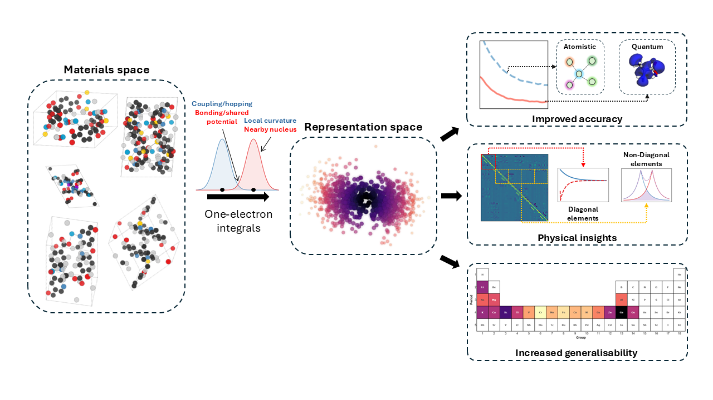

## Representing periodic systems with one-electron integral matrices
<p align="center">
  
</p>

## Welcome! 👋
This repository supports the research paper of the same name, where we investigate how one-electron integrals can be used as an effective and robust materials representation. Here you’ll find the code, data, and tools used to develop and validate the approach. 

The code in this repository allows you to generate the TM, VM, and SM representations.
Notably, for the QMOF dataset and the prediction of the PBE band gap, the TM representation demonstrates the strongest performance compared to the others.

## ❓ Why This Project?
There are many ways to represent materials—everything from simple text-based formats to computer-vision-style features and physics-inspired descriptors. But unlike the molecular world, materials science rarely uses quantum-inspired electronic information as part of the representation.
A big reason for this is that generating such data has traditionally been slow, complex, and not very practical for large datasets. Still, if we want a complete picture of a material, we shouldn’t ignore its electronic structure. In some cases, combining electronic information with geometry can make a big difference—and even become essential for predicting certain properties. 

Apart from that, traditional representations are often extremely large, making them difficult to handle and challenging to use as input for machine learning models.
The table below illustrates this for several widely used representations, showing the number of features and the memory required to load or store these arrays for 2,000 randomly selected compounds from the QMOF dataset.

<div align="center">

<table>
  <tr>
    <th>Representations</th>
    <th>Dimensions</th>
    <th>Memory [MB]</th>
  </tr>
  <tr>
    <td>MBTR</td>
    <td></td>
    <td></td>
  </tr>
  <tr>
    <td>LMBTR</td>
    <td></td>
    <td></td>
  </tr>
  <tr>
    <td>SM</td>
    <td></td>
    <td></td>
  </tr>
  <tr>
    <td>ESM</td>
    <td></td>
    <td></td>
  </tr>
  <tr>
    <td>SOAP</td>
    <td></td>
    <td></td>
  </tr>
  <tr>
    <td>TM, VM, SM</td>
    <td></td>
    <td></td>
  </tr>
</table>

</div>

## 🔧 Installation

To generate the representations based on one-electron integrals, install the package using:

```bash
pip install one_electron_matrices
```
The code depends on the following packages: [NumPy](https://numpy.org/), [Pandas](https://pandas.pydata.org/), [ASE](https://ase-lib.org/), and [ASE](https://pyscf.org/).

Producing the representation for a single molecule is not very useful when training a machine-learning model. However, when using the one_electron_matrices package, only one CIF file is needed to compute its corresponding representation. To generate representations for multiple CIF files in parallel, you can use the following code:
```python
from joblib import Parallel, delayed
from pathlib import Path
from one_electron_matrices import oem_rep

# Path to your CIF directory
cif_folder = Path("PATH_TO_CIFS")

# Path to the output folder (each representation will be saved individually)
output_folder = Path("OUTPUT_PATH")
output_folder.mkdir(exist_ok=True, parents=True)

# Collect all CIF files
cif_files = sorted(cif_folder.glob("*.cif"))

# Number of parallel workers (adjust to your CPU)
N = 28

# Run in parallel
Parallel(n_jobs=N)(
    delayed(oem_rep)(cif_path, output_folder=output_folder)
    for cif_path in cif_files)
```
## 🚀 How to Use
For generating the full one-electron–integral–based representations, the basis set is the only user-defined parameter. By default, we recommend using the redefined pcseg-0 basis set.

`oem_rep(CIF_file,basis_set='pcseg-0', int_type='TM', PCA_red=9, norm=True, sort=True)`

To compute a representation, the user must provide:

`CIF_file` – path to the CIF structure

`int_type` – which matrix to calculate:

> `TM` → kinetic energy matrix

> `VM` → nuclear attraction matrix

> `SM` → overlap matrix

Additional options:

`norm` =True → normalize the representation

`sort` =True → sort the representation by atomic orbital order

`PCA_red` =<int> → number of principal components for the reduced representation

Setting `PCA_red` applies PCA and returns a reduced-dimensionality version of the representation.

## Data Splitting
As seen the data splitting technique when training and testing a model plays a crutial role. Three data splitting etchniques were used in the article. To use them, import the required packages as follows:

Random split: `from sklearn.model_selection import train_test_split`

Kennard-Stone split: `from kennard_stone import train_test_split`

Chemically-relevant split: [separate_compounds_from_metalic_component](https://github.com/grynova-ccc/quantum_periodic_representations/blob/main/Codes/ML_and_data_science/auxiliary_functions.ipynb)

## Contributing
Contributions are welcome! Feel free to submit a pull request or open an issue.

## Contact
If you have questions, feel free to reach out: stivllenga@gmail.com

## Final Note
If you find this project useful, please give it a ⭐! It really helps.

## Citation
If you use this project in your research, please cite:
URL URL URL


